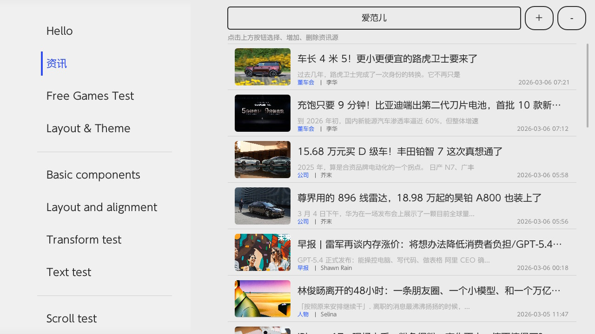
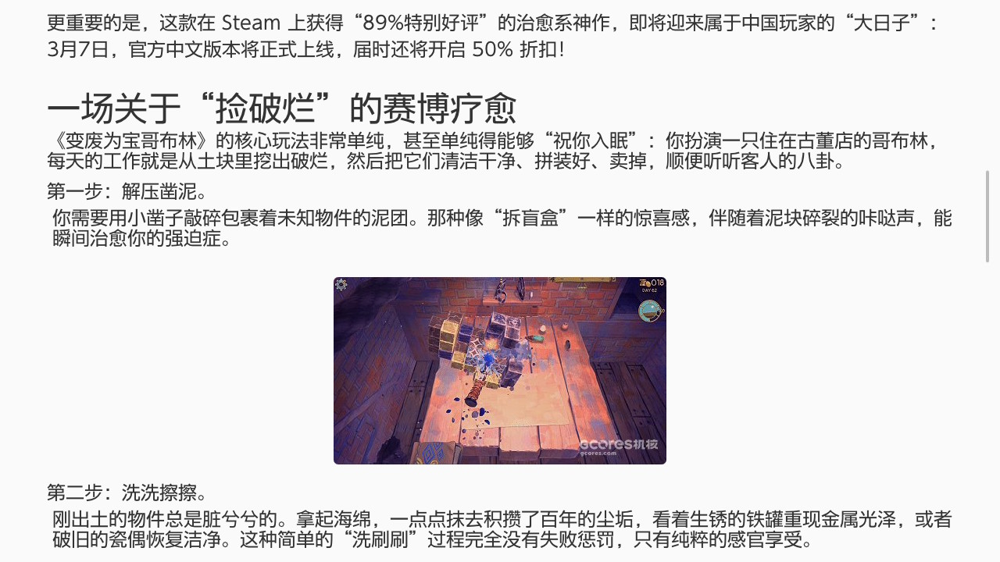
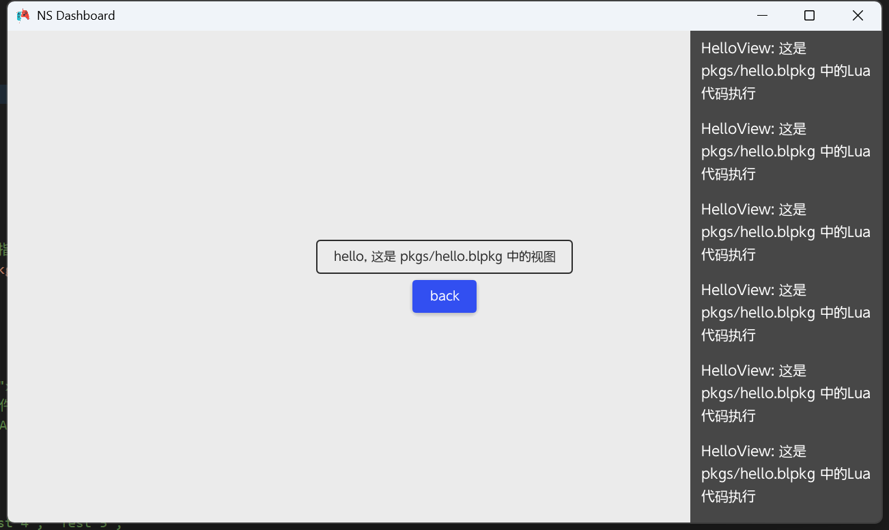
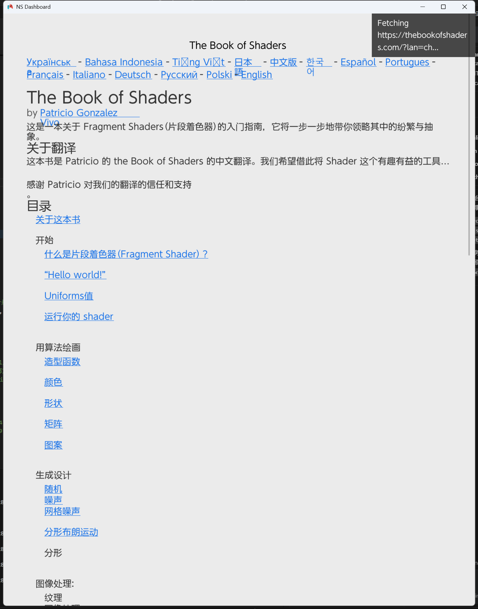
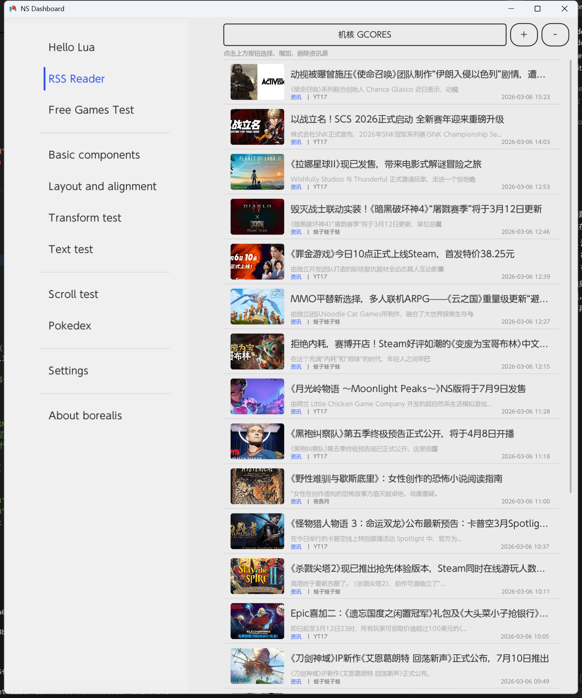
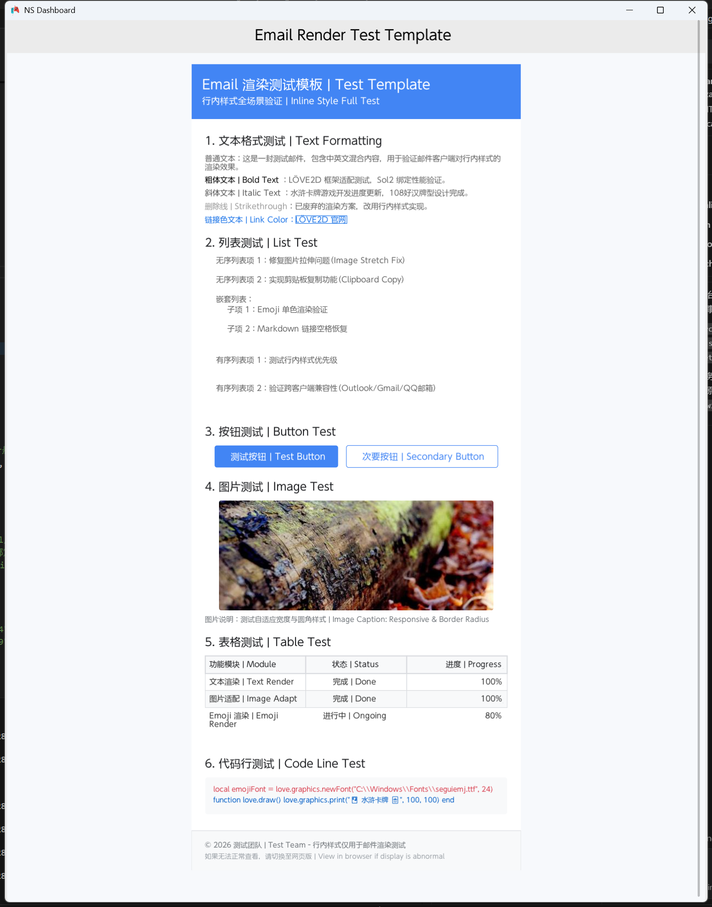

# Lorealis 
Lorealis is a Lua-enhanced fork of the Borealis UI framework, specifically engineered to be the ultimate UI library for handheld computers and portable devices. Built on top of Borealis' modern, cross-platform UI foundation, Lorealis exposes full-featured UI APIs via Lua 5.1/LuaJIT bindings (powered by Sol2), enabling developers to rapidly build intuitive, responsive, and resource-efficient user interfaces tailored for the constraints of handheld hardware (e.g., limited memory, lower CPU frequency).
Key strengths include modular XML-based UI layout, pluggable Lua script support, internationalization (i18n) out of the box, and seamless compatibility with popular handheld platforms. Whether for lightweight office tools, RSS readers, markdown viewers, or multimedia applications, Lorealis strikes the perfect balance between ease of development (via Lua's dynamic scripting) and performance (leveraging LuaJIT's JIT compilation), making it the top choice for handheld UI development.


Controller and TV oriented UI library for Android, iOS, PC, PS4, PSV and Nintendo Switch.

- Mimicks the Nintendo Switch system UI, but can also be used to make anything else painlessly
- Hardware acceleration and vector graphics with automatic scaling for TV usage (powered by nanovg)
- Can be ported to new platforms and graphics APIs by providing a nanovg implementation
- Powerful layout engine using flex box as a base for everything (powered by Yoga Layout)
- Automated navigation paths for out-of-the-box controller navigation
- Out of the box touch support
- Define user interfaces using XML and only write code when it matters
- Use and restyle built-in components or make your own from scratch
- Display large amount of data efficiently using recycling lists
- Integrated internationalization and storage systems
- Integrated toolbox (logger, animations, timers, background tasks...)

## Windows build
```PowerShell
1. Clear cache
Remove-Item -Recurse -Force build
2. Configure
cmake -B build -G "Visual Studio 16 2019" -DPLATFORM_DESKTOP=ON
3. Build
cmake --build build --config Release


cmake -B build -DMPV_DIR="e:/Works/Projects/ns-chat/extern/mpv-dev" . 
cmake --build build --config Release

"C:\Program Files\CMake\bin\cmake.exe" -B build -G "Visual Studio 16 2019" -DPLATFORM_DESKTOP=ON
"C:\Program Files\CMake\bin\cmake.exe" --build build --config Release
```

## NRO Build (Docker)

### PowerShell
```powershell
docker run --rm -v "${PWD}:/data" devkitpro/devkita64:20260219 bash -c "/data/build_switch.sh"

docker run --rm -v "%cd%:/data" devkitpro/devkita64:20251117 bash -c "/data/build_switch.sh"

# copy to ns
docker run --rm -it -v E:\Works\Projects\lorealis\build_switch:/work devkitpro/devkita64:20260219 bash
/opt/devkitpro/tools/bin/nxlink -a 192.168.31.91 /work/lorealis.nro
```


## TODO
- [ ] Theme Compatibility
- [ ] I18n Bundle Lazy Loading
- [ ] Luajit Tests
- [ ] Component Enhancement 

## Screenshots
<p align="center">
<style>
    /* 核心两列瀑布流容器 */
    .two-col-waterfall {
      column-count: 2;          /* 固定2列（核心） */
      column-gap: 10px;         /* 列之间的间距 */
      max-width: 900px;         /* 限制总宽度，避免太宽 */
      margin: 0 auto;           /* 居中显示 */
    }
    /* 图片样式：关键是不截断+自适应 */
    .two-col-waterfall img {
      width: 100%;              /* 图片宽度填满列 */
      height: auto;             /* 保留原始高宽比（高低不同才会插进去） */
      margin-bottom: 10px;      /* 图片之间的间距 */
      break-inside: avoid;      /* 禁止图片被列截断（核心中的核心） */
      border-radius: 4px;       /* 可选：圆角更美观 */
    }
    /* 适配手机：小屏幕自动变1列 */
    @media (max-width: 375px) {
      .two-col-waterfall {
        column-count: 1;
      }
    }
  </style>

  
  <div class="two-col-waterfall">
    
    
    
    
    
    
    
    
    
    
    

  </div>
</p>

## Credits 
- Thanks to [Natinusala](https://github.com/natinusala), [xfangfang](https://github.com/xfangfang) and [XITRIX](https://github.com/XITRIX) for [borealis](https://github.com/xfangfang/borealis)
