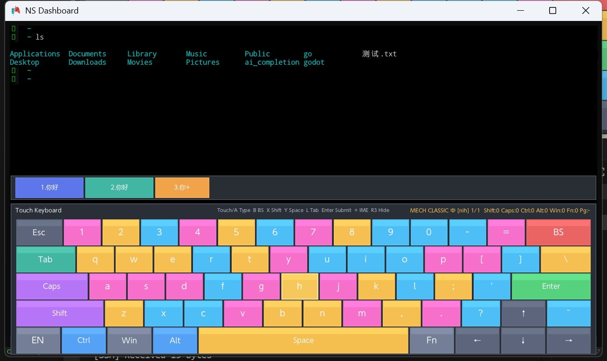
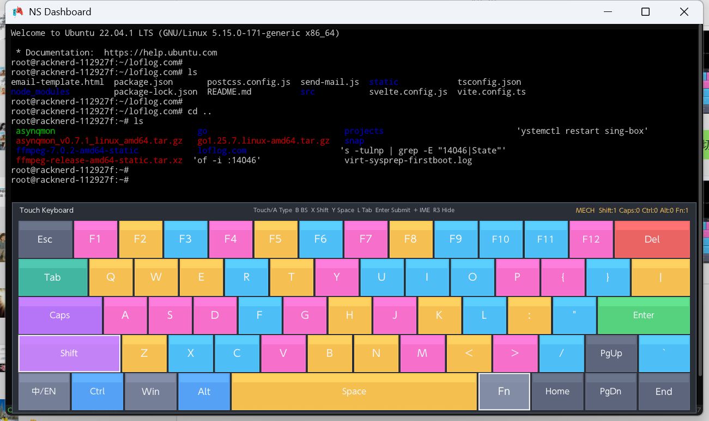

# Lorealis 
Lorealis is a Lua-enhanced fork of the Borealis UI framework, specifically engineered to be the ultimate UI library for handheld computers and portable devices. Built on top of Borealis' modern, cross-platform UI foundation, Lorealis exposes full-featured UI APIs via Lua 5.1/LuaJIT bindings (powered by Sol2), enabling developers to rapidly build intuitive, responsive, and resource-efficient user interfaces tailored for the constraints of handheld hardware (e.g., limited memory, lower CPU frequency).
Key strengths include modular XML-based UI layout, pluggable Lua script support, internationalization (i18n) out of the box, and seamless compatibility with popular handheld platforms. Whether for lightweight office tools, RSS readers, markdown viewers, or multimedia applications, Lorealis strikes the perfect balance between ease of development (via Lua's dynamic scripting) and performance (leveraging LuaJIT's JIT compilation), making it the top choice for handheld UI development.


Controller and TV oriented UI library for Android, iOS, PC, PS4, PSV and Nintendo Switch.

- Mimicks the Nintendo Switch system UI, but can also be used to make anything else painlessly
- Hardware acceleration and vector graphics with automatic scaling for TV usage (powered by nanovg)
- Can be ported to new platforms and graphics APIs by providing a nanovg implementation
- Powerful layout engine using flex box as a base for everything (powered by Yoga Layout)
- Automated navigation paths for out-of-the-box controller navigation
- Out of the box touch support
- Define user interfaces using XML and only write code when it matters
- Use and restyle built-in components or make your own from scratch
- Display large amount of data efficiently using recycling lists
- Integrated internationalization and storage systems
- Integrated toolbox (logger, animations, timers, background tasks...)

## SSH Client Module

Lorealis includes a full-featured SSH client module (`mod/ssh`) for cross-platform remote terminal access on both Switch NRO and Desktop.

### Features
- **Full SSH Protocol**: Password and public key authentication, PTY shell, xterm-256color terminal
- **ANSI Terminal**: Complete VT100/ANSI escape sequence parser (colors, cursor, scroll regions, 256 colors, true color)
- **Cross-Platform Input**:
  - **Switch**: Controller mapping to VT100 sequences (A=keyboard, B=backspace, X=Ctrl+C, Y=EOF, LT/RT=scroll history)
  - **PC**: Direct physical keyboard input with Ctrl/Alt modifiers
- **Session Management**: Save connections as JSON, auto-reconnect, fingerprint verification
- **UTF-8 Support**: Full Unicode rendering with CJK wide character detection

### File Structure
```
mod/ssh/
├── module.ini              # Module metadata
├── lua/
│   ├── main.lua            # Entry point
│   ├── platform.lua        # Platform detection & key mappings
│   ├── ansi_parser.lua     # ANSI escape sequence parser
│   ├── terminal_buffer.lua # Terminal screen buffer
│   ├── ssh_manager.lua     # SSH session lifecycle
│   ├── keyboard.lua        # Switch swkbd & controller input
│   ├── terminal_view.lua   # NanoVG terminal rendering
│   ├── connection_view.lua # Connection list UI
│   └── saved_connections.lua # JSON persistence
└── xml/
    ├── connect.xml         # Connection list layout
    └── terminal.xml        # Terminal layout
```

### Lua API
```lua
local ssh = require("ssh_manager")
local session = ssh.new()
session:connect({
    host = "192.168.1.1",
    port = 22,
    user = "root",
    password = "secret",
    cols = 100,
    rows = 36
})
session:send("ls -la\r")
```

### Build Requirements
- **Switch**: devkitPro with `libssh2` (`dkp-pacman -S switch-libssh2`)
- **Desktop**: CMake will auto-fetch libssh2 if not found via pkgconfig

---

## Windows build
```PowerShell
1. Clear cache
Remove-Item -Recurse -Force build
2. Configure
cmake -B build -G "Visual Studio 16 2019" -DPLATFORM_DESKTOP=ON
3. Build
cmake --build build --config Release


cmake -B build -DMPV_DIR="e:/Works/Projects/ns-chat/extern/mpv-dev" . 
cmake --build build --config Release

"C:\Program Files\CMake\bin\cmake.exe" -B build -G "Visual Studio 16 2019" -DPLATFORM_DESKTOP=ON
"C:\Program Files\CMake\bin\cmake.exe" --build build --config Release
```

## Linux BUild
```shell
sudo apt install -y build-essential cmake pkg-config git libx11-dev libxrandr-dev libxinerama-dev libxcursor-dev libxi-dev libxext-dev libxkbcommon-dev libdbus-1-dev libgl1-mesa-dev libegl1-mesa-dev

cmake -B build -DPLATFORM_DESKTOP=ON -DGLFW_BUILD_X11=ON -DGLFW_BUILD_WAYLAND=OFF
```

### Mac Build
```shell
cmake --build build --config Release

```


## NRO Build (Docker)

### PowerShell
```powershell
docker run --rm -v "${PWD}:/data" devkitpro/devkita64:20260219 bash -c "/data/build_switch.sh"

# fast repack for lua or xml changed
docker run --rm -v "${PWD}:/data" devkitpro/devkita64:20260219 bash -c "/data/scripts/repack_switch_romfs.sh"

# copy to ns
docker run --rm -it -v "${PWD}/build_switch":/work devkitpro/devkita64:20260219 bash

/opt/devkitpro/tools/bin/nxlink -a 192.168.31.91 /work/lorealis.nro

```


## TODO
- [x] Lua integration is being gradually refined
- [x] Markdown & HTML renderer is not perfect
- [x] RSS reader (first version) is completed
- [x] SSH remote tool (first version) is completed
- [ ] Theme Compatibility
- [ ] I18n Bundle Lazy Loading
- [ ] Luajit Tests
- [ ] Component Enhancement 

## Screenshots
<p align="center">
  <!-- 纯内联样式实现两列瀑布流，适配GitHub渲染规则 -->
  <div style="column-count: 2; column-gap: 10px; max-width: 900px; margin: 0 auto;">
     
    
    
    
    
    
    
    
    
    
    
    
    
  </div>
</p>

## Credits 
- Thanks to [Natinusala](https://github.com/natinusala), [xfangfang](https://github.com/xfangfang) and [XITRIX](https://github.com/XITRIX) for [borealis](https://github.com/xfangfang/borealis)
